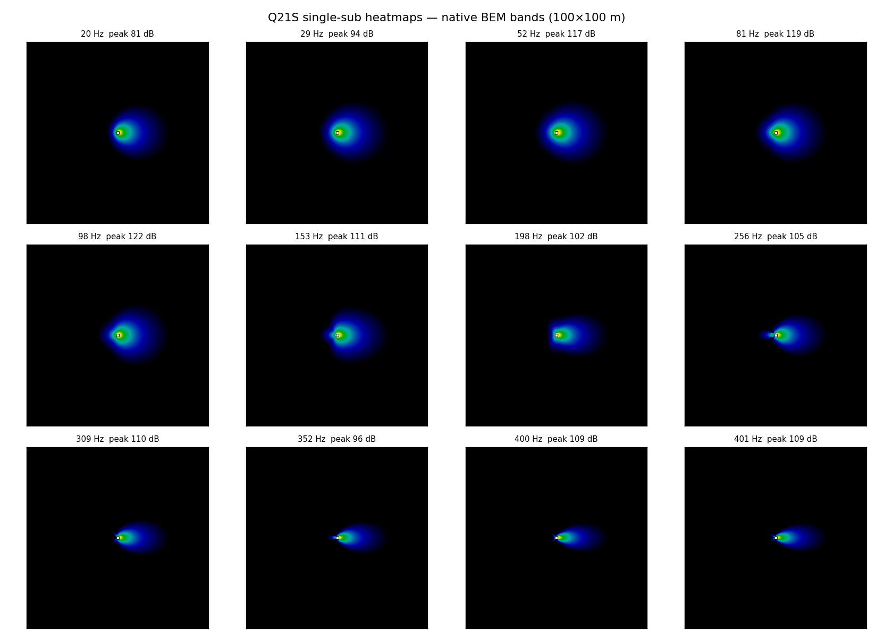
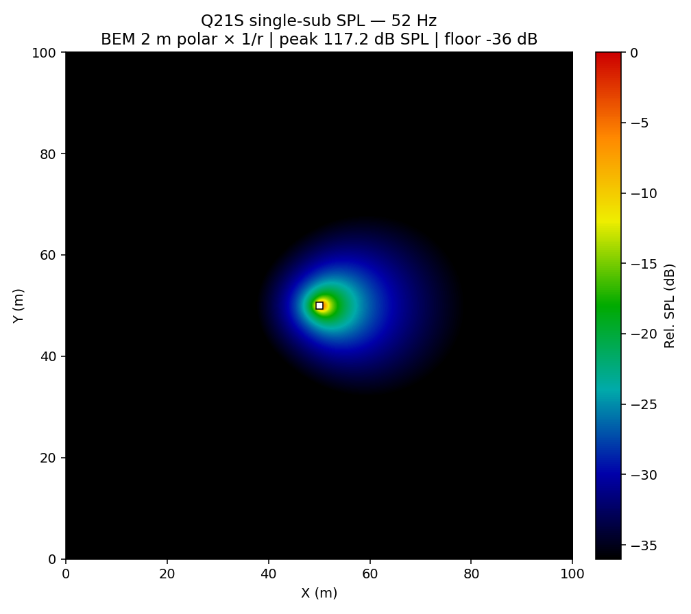
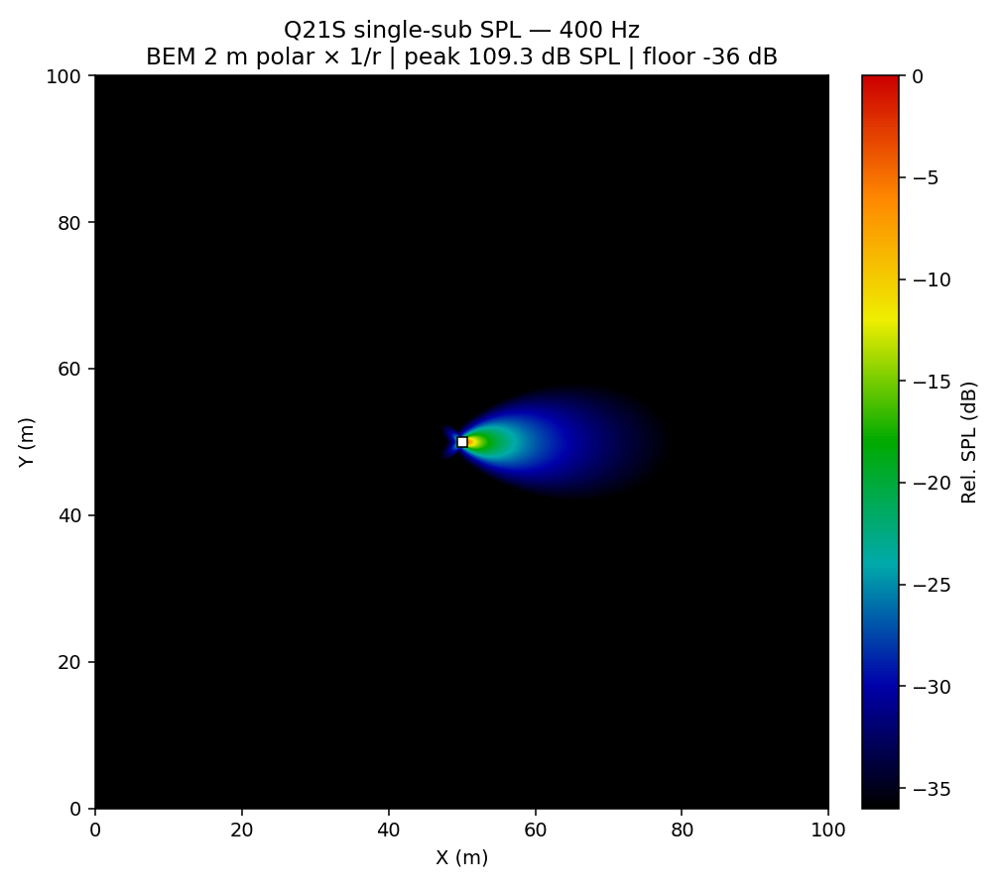
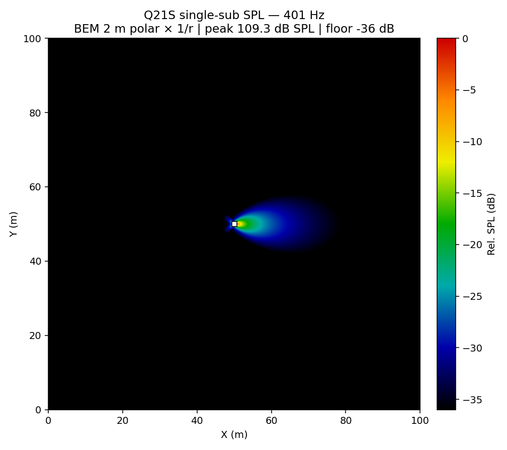

# Q21S single-sub SPL heatmap

How **one Q21S** builds the 100×100 m SPL heatmap in this software, with **accurate heatmaps at every native BEM frequency**, so you can recreate the same result on another PC.

**Cabinet:** W 750 mm × H 784 mm × D 917 mm  
**World:** 100 m × 100 m  
**Catalogue Hz:** 20, 29, 52, 81, 98, 153, 198, 256, 309, 352, 400, 401

---

## All frequencies (overview)



Each panel is the **same physics as the app**: BEM 2 m polar × spherical spreading (`1/r`), peak-normalised for colour (0 … −36 dB). Absolute peak dB SPL is in the title of each full-size figure below.

---

## How it works (single sub)

```text
BEM_Data_10m/<Hz>Hz.xlsx
        │  complex pressure → SPL = 20·log10(|p|/20µPa)
        ▼
Pack CSV  Q21S_<Hz>Hz_2p0m.csv     (degree, dBSPL)   ← far-field arc @ 2 m
        │
        ▼
D(θ) = 10^((SPL(θ) − SPL(0°)) / 20)     on-axis = 1
SPL₀ = SPL(0°) at R_ref = 2 m
        │
        ▼
AcousticEngine / this script (one cabinet at world centre)
  r_geom   = distance to grid point
  r_spread = max(r_geom, cabinet_half_depth)     # 0.917/2 m
  amp      = D(θ) / r_spread                     # pressure ~ 1/r
  I        = amp²                                # intensity ~ 1/r²
  SPL(r,θ) = SPL₀ + 10·log10( I / (1/R_ref²) )
```

### Inverse-square check (must hold for every Hz)

On-axis:

```text
SPL(2 m) = SPL₀ from the BEM CSV
SPL(4 m) = SPL(2 m) − 6.02 dB
```

Verified for all native bands (see `single_sub_heatmap/figures/summary.csv`):

| Hz | BEM on-axis @ 2 m | Sim @ 2 m | Sim @ 4 m | Drop |
|----|-------------------|-----------|-----------|------|
| 20 | 67.84 | 67.84 | 61.81 | 6.02 |
| 29 | 81.14 | 81.14 | 75.12 | 6.02 |
| 52 | 104.36 | 104.36 | 98.34 | 6.02 |
| 81 | 106.03 | 106.03 | 100.01 | 6.02 |
| 98 | 109.52 | 109.52 | 103.50 | 6.02 |
| 153 | 98.25 | 98.25 | 92.23 | 6.02 |
| 198 | 89.41 | 89.41 | 83.39 | 6.02 |
| 256 | 91.86 | 91.86 | 85.84 | 6.02 |
| 309 | 97.07 | 97.07 | 91.05 | 6.02 |
| 352 | 83.68 | 83.68 | 77.66 | 6.02 |
| 400 | 96.52 | 96.52 | 90.50 | 6.02 |
| 401 | 96.51 | 96.51 | 90.49 | 6.02 |

**401 Hz** is a duplicate export of **400 Hz** in the BEM set — treat as the same band.

### What is *not* used for the live 100×100 m map

- The ±5 m BEM field stamp (`Q21S_Field_*.q21f`) — that is only a 10×10 m island.
- Near-field 0.5 m polars — Measured Polar view only; heatmap uses **2 m**.
- Baffled-piston model — only if measured tables are missing.

### Multi-sub (for context)

N cabinets = N copies of the **same** BEM polar source. Pressures add as complex numbers (gain / delay / polarity / placement). This doc is **single-sub only**.

---

## Heatmaps by frequency

Colour = relative SPL (peak = 0 dB, floor = −36 dB). White square = cabinet centre. Absolute peak is in each title.

### 20 Hz


### 29 Hz


### 52 Hz



### 81 Hz


### 98 Hz


### 153 Hz


### 198 Hz


### 256 Hz


### 309 Hz


### 352 Hz


### 400 Hz



### 401 Hz (= 400 Hz physics)



---

## Recreate on another PC

### 1. Get the project

```bash
git clone https://github.com/Abhishek371222/prediction-software.git
cd prediction-software
```

(Or copy the whole `Prediction Software` folder.)

### 2. Required data (already in repo if cloned with pack CSVs)

| Path | Role |
|------|------|
| `BEM_Data_10m/<Hz>Hz.xlsx` | Source BEM fields |
| `ShyamGui/prediction software/MeasurementIntegrationPack/Data/Q21S_*Hz_2p0m.csv` | Runtime polars |
| `ShyamGui/Source/AcousticEngine.cpp` | Live app solver |
| `docs/q21s_bem_plots/generate_single_sub_heatmaps.py` | Offline heatmap generator |

If pack CSVs are missing, regenerate from BEM xlsx:

```bash
python3 docs/q21s_bem_plots/export_q21s_native_hz_pack.py
```

Needs: `numpy`, `openpyxl`, `scipy`.

### 3. Regenerate these heatmaps

```bash
pip3 install numpy matplotlib
python3 docs/q21s_bem_plots/generate_single_sub_heatmaps.py
```

Outputs:

- `docs/single_sub_heatmap/figures/Q21S_single_sub_<Hz>Hz.png`
- `docs/single_sub_heatmap/figures/Q21S_single_sub_all_freqs.png`
- `docs/single_sub_heatmap/figures/summary.csv`

### 4. Run the macOS app (same physics)

```bash
zsh ShyamGui/Builds/MacManual/build_macos15.sh --run
```

In the UI:

1. Place **1** Q21S (or use “1 Device”).
2. Pick a catalogue frequency.
3. RUN → SPL heat map fills the full **100×100 m** world.
4. EXPORT SPL (CSV) → `spl_dB` is absolute BEM-calibrated dB; at 2 m on-axis it matches the CSV above.

### 5. Sanity checks on the new PC

| Check | Expect |
|-------|--------|
| 1 box, 52 Hz, on-axis @ 2 m | ≈ **104.36 dB SPL** |
| Same, @ 4 m | ≈ **98.34 dB** (−6 dB) |
| Heatmap shape | Follows measured polar (not a ±5 m rectangle) |
| Grid | Fills 0…100 m, not a crop |

---

## Code map

| Piece | File |
|-------|------|
| Frequencies | `ShyamGui/Source/AcousticEngine.h` → `kSupportedFrequencies` |
| Cabinet size | `Q21SCabinet` in `AcousticEngine.h` (750×784×917 mm) |
| Polar load + `D(θ)` | `ShyamGui/Source/MeasurementData.h` → `buildDirectivityTables` |
| Prefer 2 m for sim | `farFieldDirectivityDistance` |
| Field compute | `ShyamGui/Source/AcousticEngine.cpp` → `compute` |
| Heatmap colour | `RadiationPatternComponent` + `ColourMaps::sevenColor` |
| Offline twin of engine | `docs/q21s_bem_plots/generate_single_sub_heatmaps.py` |

---

## Formula card (copy this)

```text
R_ref = 2 m
SPL₀  = dBSPL at 0° from Q21S_<Hz>Hz_2p0m.csv
D(θ)  = 10^((SPL(θ) − SPL₀) / 20)

amp   = D(θ) / max(r, 0.4585)          # half of 917 mm depth
SPL   = SPL₀ + 10·log10( amp² / (1/R_ref²) )
      = SPL₀ + 20·log10( R_ref / r )     # on-axis, D=1
```

That is the entire single-sub heatmap.
